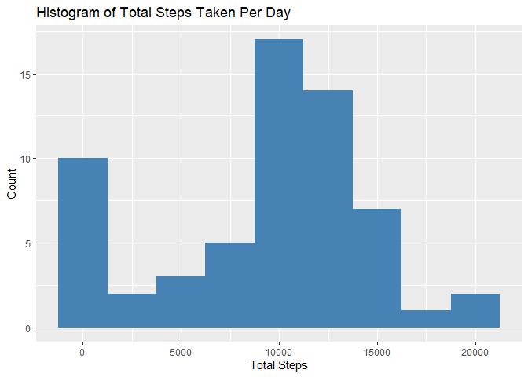
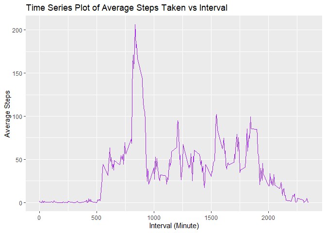
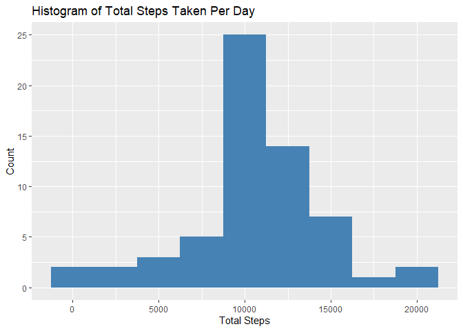
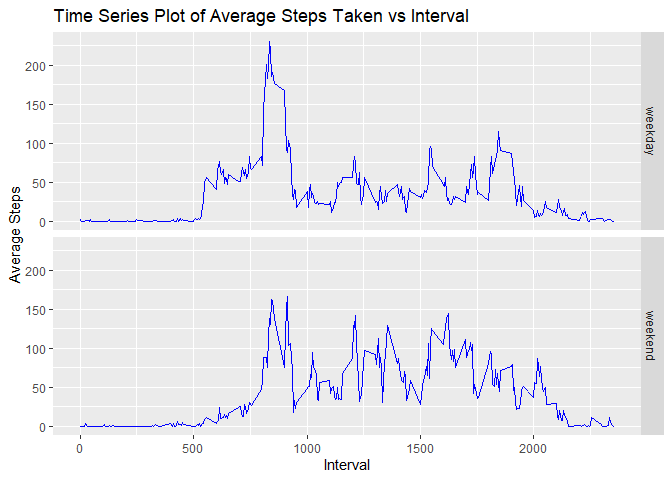

## Loading necessary packages

In this report, I will use `dplyr` package for modifying and analyzing the
data set, and the `ggplot2` package to display plot the data, and `lubridate`
package to deal with dates.


```r
library(dplyr)
```

```
## 
## Attaching package: 'dplyr'
```

```
## The following objects are masked from 'package:stats':
## 
##     filter, lag
```

```
## The following objects are masked from 'package:base':
## 
##     intersect, setdiff, setequal, union
```

```r
library(ggplot2)
library(lubridate)
```

```
## 
## Attaching package: 'lubridate'
```

```
## The following objects are masked from 'package:base':
## 
##     date, intersect, setdiff, union
```

## Loading and preprocessing the data


```r
df <- read.csv("activity.csv")
dim(df)
```

```
## [1] 17568     3
```

```r
summary(df)
```

```
##      steps            date              interval     
##  Min.   :  0.00   Length:17568       Min.   :   0.0  
##  1st Qu.:  0.00   Class :character   1st Qu.: 588.8  
##  Median :  0.00   Mode  :character   Median :1177.5  
##  Mean   : 37.38                      Mean   :1177.5  
##  3rd Qu.: 12.00                      3rd Qu.:1766.2  
##  Max.   :806.00                      Max.   :2355.0  
##  NA's   :2304
```

Have to convert the date column from character class to Date class


```r
df <- transform(df, date = ymd(date))
summary(df)
```

```
##      steps             date               interval     
##  Min.   :  0.00   Min.   :2012-10-01   Min.   :   0.0  
##  1st Qu.:  0.00   1st Qu.:2012-10-16   1st Qu.: 588.8  
##  Median :  0.00   Median :2012-10-31   Median :1177.5  
##  Mean   : 37.38   Mean   :2012-10-31   Mean   :1177.5  
##  3rd Qu.: 12.00   3rd Qu.:2012-11-15   3rd Qu.:1766.2  
##  Max.   :806.00   Max.   :2012-11-30   Max.   :2355.0  
##  NA's   :2304
```

## What is mean total number of steps taken per day?

### Calculating total number of steps taken per day


```r
tbl_mean_steps <- df %>% group_by(date) %>%
                    summarise(total.steps = sum(steps, na.rm = TRUE))
```

```
## `summarise()` ungrouping output (override with `.groups` argument)
```

### Histogram of total number of steps taken each day


```r
g <- ggplot(data = tbl_mean_steps)
g + geom_histogram(mapping = aes(x = total.steps), binwidth = 2500,
                   fill = "steelblue") +
    labs(title = "Histogram of Total Steps Taken Per Day",
         x = "Total Steps", y = "Count")
```

<!-- -->

The mean and median of total number of steps taken per day are as follows:


```r
mn0 <- round(mean(tbl_mean_steps$total.steps), digits = 2)
md0 <- round(median(tbl_mean_steps$total.steps), digits = 2)

mn0
```

```
## [1] 9354.23
```

```r
md0
```

```
## [1] 10395
```


## What is the average daily activity pattern?

### Making a time series plot


```r
ts_data <- df %>% group_by(interval) %>%
            summarise(mean.steps = mean(steps, na.rm = TRUE))
```

```
## `summarise()` ungrouping output (override with `.groups` argument)
```

```r
g <- ggplot(data = ts_data, mapping = aes(x = interval, y = mean.steps))
g + geom_line(colour = "purple") +
    labs(title = "Time Series Plot of Average Steps Taken vs Interval",
         x = "Interval (Minute)", y = "Average Steps")
```

<!-- -->

The 5-minute interval starting at
835 minute
contains the maximum number of steps, averaged across all days.

## Imputing missing values


```r
sum(is.na(df$steps))
```

```
## [1] 2304
```

We can see that there are total of 2304 missing values in the
data. We will replace them by the average number of steps taken during that interval.


```r
# Separate the entries with missing values from the others
df_na <- df[is.na(df$steps), ]
df_not_na <- df[!is.na(df$steps), ]

# Create a merged data frame using "interval" column
mrg <- merge(df_na, ts_data, by = "interval") %>% mutate(steps = mean.steps) %>%
        select(steps, date, interval)

# Create the new data frame with zero missing values
df_new <- rbind(mrg, df_not_na) %>% arrange(date, interval)

# Verify that there are no missing values
sum(is.na(df_new$steps))
```

```
## [1] 0
```

### Histogram of total number of steps taken each day


```r
tbl_mean_steps_new <- df_new %>% group_by(date) %>%
                    summarise(total.steps = sum(steps, na.rm = TRUE))
```

```
## `summarise()` ungrouping output (override with `.groups` argument)
```

```r
# Drawing Plot
g <- ggplot(data = tbl_mean_steps_new)
g + geom_histogram(mapping = aes(x = total.steps), binwidth = 2500,
                   fill = "steelblue") +
    labs(title = "Histogram of Total Steps Taken Per Day",
         x = "Total Steps", y = "Count")
```

<!-- -->

The mean and median of total number of steps taken per day are as follows:


```r
mn1 <- round(mean(tbl_mean_steps_new$total.steps), digits = 2)
md1 <- round(median(tbl_mean_steps_new$total.steps), digits = 2)

mn1
```

```
## [1] 10766.19
```

```r
md1
```

```
## [1] 10766.19
```

Imputing the data has changed the mean and median from 9354.23 and 1.0395\times 10^{4} from
first section to 1.076619\times 10^{4} and 1.076619\times 10^{4} respectively. Change in the total daily number
of steps taken can be observed as follows:

```r
total0 <- sum(tbl_mean_steps$total.steps)
total1 <- sum(tbl_mean_steps_new$total.steps)

total0
```

```
## [1] 570608
```

```r
total1
```

```
## [1] 656737.5
```

## Are there differences in activity patterns between weekdays and weekends?


```r
df_new <- df_new %>% mutate(day.of.week = wday(date, label = TRUE))
dim(df_new)
```

```
## [1] 17568     4
```

```r
head(df_new)
```

```
##       steps       date interval day.of.week
## 1 1.7169811 2012-10-01        0         Mon
## 2 0.3396226 2012-10-01        5         Mon
## 3 0.1320755 2012-10-01       10         Mon
## 4 0.1509434 2012-10-01       15         Mon
## 5 0.0754717 2012-10-01       20         Mon
## 6 2.0943396 2012-10-01       25         Mon
```

```r
# Create a new vector indicating whether the day.of.month is a weekday or a
# weekend
day <- mapply(df_new$day.of.week,
              FUN = function(x){if(x %in% c("Sat","Sun")){"weekend"}
                  else{"weekday"}})

df_new <- df_new %>% mutate(day = factor(day))

# Calculate average number of steps taken across intervals
df_new <- df_new %>% group_by(interval, day) %>% mutate(mean.steps = mean(steps))

df_new
```

```
## # A tibble: 17,568 x 6
## # Groups:   interval, day [576]
##     steps date       interval day.of.week day     mean.steps
##     <dbl> <date>        <int> <ord>       <fct>        <dbl>
##  1 1.72   2012-10-01        0 Mon         weekday     2.25  
##  2 0.340  2012-10-01        5 Mon         weekday     0.445 
##  3 0.132  2012-10-01       10 Mon         weekday     0.173 
##  4 0.151  2012-10-01       15 Mon         weekday     0.198 
##  5 0.0755 2012-10-01       20 Mon         weekday     0.0990
##  6 2.09   2012-10-01       25 Mon         weekday     1.59  
##  7 0.528  2012-10-01       30 Mon         weekday     0.693 
##  8 0.868  2012-10-01       35 Mon         weekday     1.14  
##  9 0      2012-10-01       40 Mon         weekday     0     
## 10 1.47   2012-10-01       45 Mon         weekday     1.80  
## # ... with 17,558 more rows
```

```r
# Plot tie series
g <-  ggplot(data = df_new, mapping = aes(x = interval, y = mean.steps))
g + geom_line(colour = "blue") + facet_grid(day ~ .) +
    labs(title = "Time Series Plot of Average Steps Taken vs Interval",
         x = "Interval", y = "Average Steps")
```

<!-- -->
